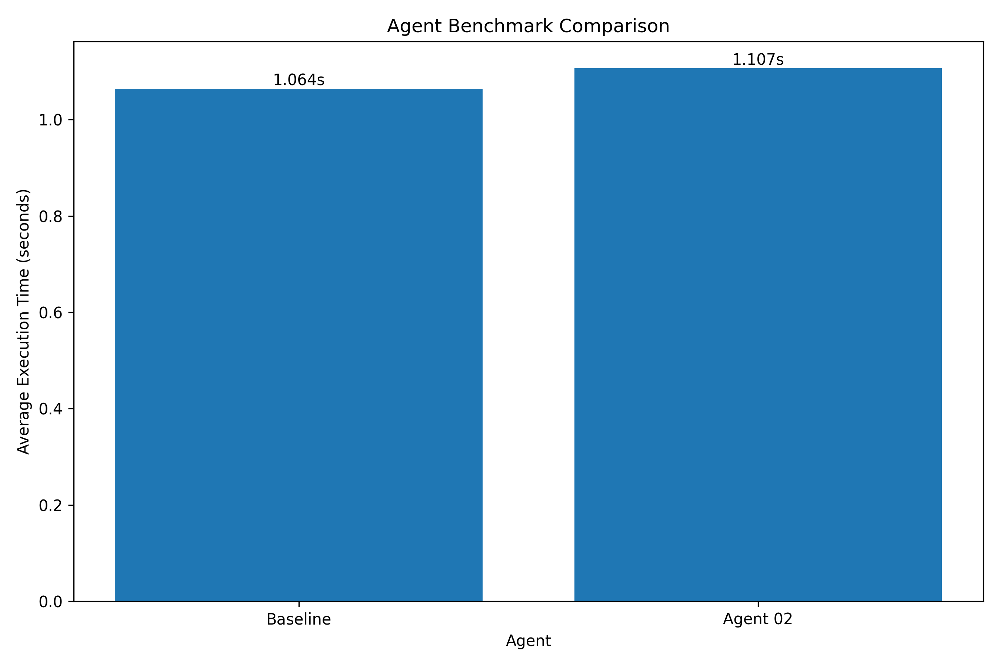

# AI Agent Evaluation Framework

A task-based evaluation framework for testing coding agents against
visible tests and hidden tests.


## Features

- Baseline and agent evaluation
- Multiple independent runs
- Hidden-test verification
- Attempt and recovery tracking
- CSV result generation
- Success-rate comparison
- Failure classification

## Completed Evaluation

| Task | Agent | Runs | Success Rate |
|------|-------|------|--------------|
| task_32 | baseline | 5 | 100% |
| task_32 | agent_02 | 5 | 100% |

## Tech Stack

- Python
- Pytest
- CSV
- PowerShell
- Git

## Run Tests

```powershell
python -m pytest .\tasks\task_32 -q

## Agent Benchmark Results

The benchmark evaluated two agents across 32 tasks, with 5 runs per agent.

| Metric | Baseline | Agent 02 |
|---|---:|---:|
| Total tasks | 32 | 32 |
| Total evaluations | 160 | 160 |
| Success rate | 100% | 100% |
| Average execution time | 1.064 seconds | 1.107 seconds |
| Faster tasks | 17 | 15 |

### Summary

- Both agents achieved a 100% success rate.
- Baseline was faster on 17 tasks.
- Agent 02 was faster on 15 tasks.
- Baseline average execution time: 1.064 seconds.
- Agent 02 average execution time: 1.107 seconds.

### Benchmark Artifacts

- `results/agent_speed_comparison.csv`
- `results/final_benchmark_summary.csv`
- `results/benchmark_chart.png`
- `results/plot_benchmark.py`
- `results/benchmark_summary.md`
- `results/benchmark_report.json`
- `results/FINAL_BENCHMARK_REPORT.md`

## 📊 Agent Benchmark Results

The evaluation framework was tested across 32 software-engineering tasks.

| Metric | Baseline | Agent 02 |
|--------|----------|----------|
| Total Evaluations | 160 | 160 |
| Success Rate | 100% | 100% |
| Average Execution Time | 1.064s | 1.107s |

### Summary

- Total tasks: 32
- Total evaluations: 320
- Baseline faster on 17 tasks
- Agent 02 faster on 15 tasks
- Both agents achieved a 100% success rate



📄 [Read the full benchmark report](results/FINAL_BENCHMARK_REPORT.md)

## Run Tests Locally

Run all 33 task test suites independently:

```powershell
.\run_all_tests.ps1

## Benchmark Results

The benchmark evaluates coding agents across 32 software-engineering tasks.

### Current Results

| Metric | Result |
|---|---:|
| Total benchmark rows | 341 |
| Unique logical runs | 341 |
| Duplicate groups | 0 |
| Overall success rate | 100% |
| Baseline runs | 160 |
| Agent 02 runs | 170 |
| Agent 03 runs | 11 |

### Agent Results

| Agent | Runs | Success Rate |
|---|---:|---:|
| `baseline` | 160 | 100% |
| `agent_02` | 170 | 100% |
| `agent_03` | 11 | 100% |

### Evaluation Metrics

- **Success rate:** Percentage of benchmark runs that completed successfully.
- **Pass@1:** Whether the first generated solution passed the evaluation tests.
- **Recovery attempts:** Additional attempts made after an initial failure.
- **Average attempts:** Average number of attempts used per benchmark run.
- **Duplicate groups:** Logical runs that appear more than once in the result dataset.

### Important Note

The current dataset contains 341 recorded benchmark runs. Results are based on the available benchmark sample and should not be interpreted as a universal measure of coding-agent performance.
